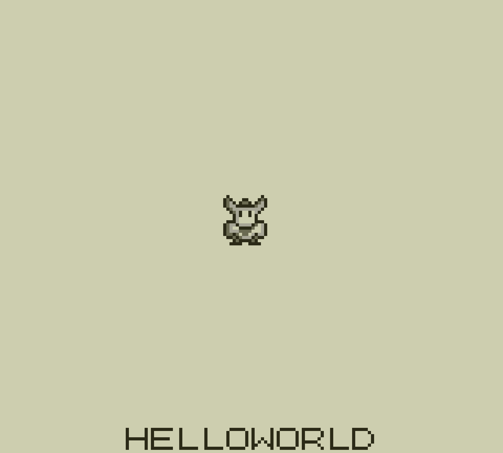

# GBDK Hello World

##  Purpose

This is a simple playground for me to learn how to program for the Game Boy (and eventually the Game Boy Color) using [GBDK 2020](https://github.com/Zal0/gbdk-2020/).

##  Building

Should anyone want to build this, you'll need to have GBDK 2020 downloaded to a commonly accessible path. For reference, I have mine in `/opt/gbdk`. If yours is different, update the lines in the makefile that reference this path.

From there, you can just run `make` in the project directoy and a `main.gb` rom file should be output.

##  Reference 

I've been loosely following a tutorial at [Digital Ephemera](https://videlais.com/2016/07/03/programming-game-boy-games-using-gbdk-part-1-configuring-programming-and-compiling/) and the structure of this project is pretty similar.

The sprite was created using [Aseprite](https://www.aseprite.org) and then fed into a [web based tool](http://jlbeard.com/gbtdg/index.html) to convert to Game Boy compliant hex.